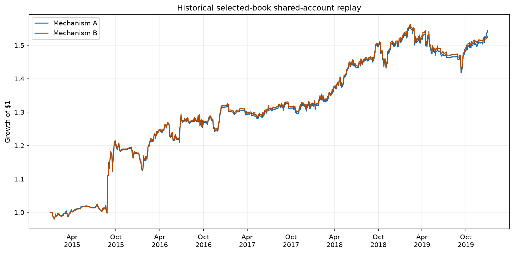
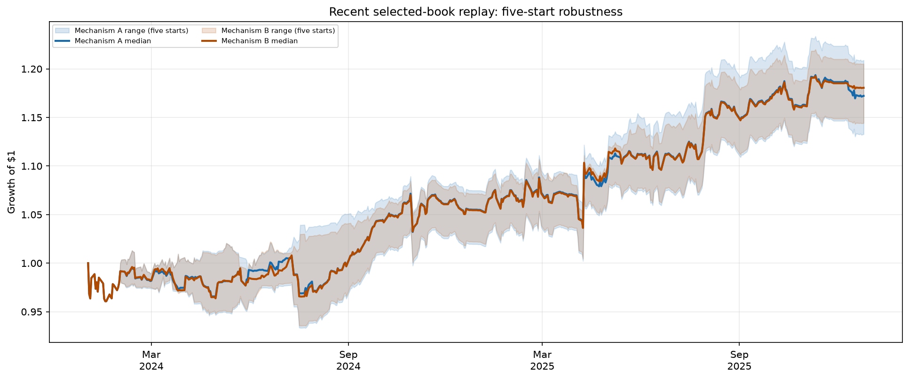

# Statistical Arbitrage Pairs Trading - Walk-Forward Research System

This repository contains a walk-forward research engine for cointegrated equity
pairs. It builds and evaluates 32 strategy configurations across 496 two-leg
candidate books, replays their trade events in a shared account, and compares
robustness across recent and historical regimes. The locked output is a
two-leg portfolio with causal momentum allocation and pinned public artifacts
for reproducibility. Live broker and execution infrastructure is outside this
repository.

## Locked Public Book

The locked configuration is [`research/selected_book_config.json`](research/selected_book_config.json).

- Leg A: `sp500-12m/cross_sector_slide1m_noscreen`
- Leg B: `sp500-2m/cross_sector_slide3m_bd7`
- Capital: `$1,000,000`; `pct_per_pair=0.25`
- Allocator: 84-day causal lookback, 0.40 step, 10%--90% bounds, 50% initial Leg A weight
- Pair universe: 496 two-leg candidate books
- Underlying sizing: hedge-ratio based; `dollar_neutral=false` in the locked configuration

The shared-account replay derives trade returns from recorded daily marks and
target-notional basis, then applies them to a common accounting pool. It does
not enforce production cash, margin, leverage, borrow, slippage, or transaction
cost constraints. Open trades are not forcibly rebalanced: Mechanism A re-bases
active fold sizing monthly, while Mechanism B applies the current weight only to
new entry flow.

## Replay Snapshot

Recent values are means over five starts; historical is one aligned 2015--2019
window. These are research-period results, not an untouched portfolio-level
holdout.

| Window | Mechanism | Annual return | Volatility | Sharpe | Max drawdown |
|---|---|---:|---:|---:|---:|
| Recent | A | 9.4462% | 8.6031% | 1.0937 | -5.5413% |
| Recent | B | 9.8116% | 8.5251% | 1.1413 | -5.5496% |
| Historical | A | 9.0980% | 8.0461% | 1.1222 | -8.9530% |
| Historical | B | 8.8316% | 8.0105% | 1.0963 | -8.8666% |

## Research Evolution

The project began as a single walk-forward cointegration pairs strategy with a
narrow mega-cap and same-sector focus. Start-date, historical-regime,
earnings, and pair-selection tests exposed instability in that early result,
leading to a 32-configuration study and a 496-book portfolio comparison rather
than continued tuning of one setup. The resulting two-leg book, Clean40
allocator, and factor diagnostics are explained in the [research journey](docs/research_journey.md).

## Validation Boundary

Individual strategy evaluation uses walk-forward out-of-sample trading folds.
The final portfolio pair and allocator were selected after comparing performance
across the displayed recent and historical research windows, so those periods
are not an untouched portfolio-level holdout. The next genuinely unseen evidence
comes from future, paper, or live observations.

## Open Strategy Decision

The canonical fixtures use the existing loss-only max-holding implementation,
which measures elapsed calendar dates. Therefore `max_holding_days=15` currently
means 15 calendar days, not 15 trading sessions. Changing this to 15 trading
sessions would alter exits and require regenerating affected leg results and
downstream artifacts.

- A: preserve the historical behavior and document it as 15 calendar days.
- B: correct it to 15 trading sessions and regenerate the affected research.

No strategy-behavior change is made in this branch.

## Public Evidence

The figures below are regenerated from the tracked shared-account replay
outputs by [`research/plot_public_results.py`](research/plot_public_results.py).

### Historical selected-book replay



### Recent start-date robustness



The recent figure shows the median and min/max range across five starts for both
replay mechanisms, rather than ten overlapping paths.

## Workflow

1. [`research/run_experiment.py`](research/run_experiment.py) runs a declarative walk-forward experiment.
2. [`scripts/build_pair_pool.py`](scripts/build_pair_pool.py) builds a metadata-bearing selection pool.
3. [`research/portfolio_selection.py`](research/portfolio_selection.py) recomputes the 496-book rankings.
4. [`research/run_combined_backtest.py`](research/run_combined_backtest.py) replays leg trade events in one shared account.
5. [`research/factor_report.py`](research/factor_report.py) runs factor diagnostics from the pinned snapshot.
6. [`research/plot_public_results.py`](research/plot_public_results.py) regenerates the public figures.
7. [`scripts/build_public_artifacts.py`](scripts/build_public_artifacts.py) writes compact metrics and the provenance manifest.

## Reproduce Published Artifacts

From the repository root:

```text
python -m pip install -e ".[dev]"
python -m pytest
python research/portfolio_selection.py
python research/run_combined_backtest.py --window recent --mechanism both
python research/run_combined_backtest.py --window historical --mechanism both
python research/factor_report.py
python research/plot_public_results.py
python scripts/build_public_artifacts.py
```

The public replay boundary is
`results/final/event_replay_inputs/`. It contains trade events and daily marks,
not raw prices or private data. The combined replay output is generated locally
and is not part of the compact tracked artifact set. The extended summary and
locked configuration are [`docs/research_summary.md`](docs/research_summary.md)
and [`research/selected_book_config.json`](research/selected_book_config.json).

## Limitations

- No borrow costs, slippage, transaction costs, or realistic capacity model are locked.
- Earnings and other single-name events can create large idiosyncratic spread moves.
- Pair overlap can concentrate exposure in the same underlying names.
- Factor alpha estimates are diagnostics, not proof of factor-neutral excess return.
- Exact full-leg reproduction requires the fixed event inputs and compatible source data; vendor downloads can change.
